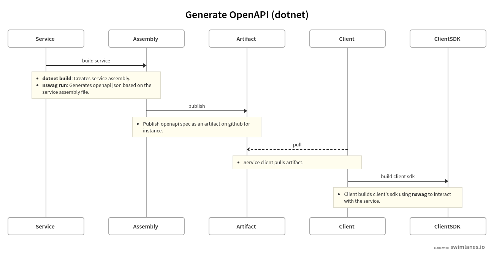
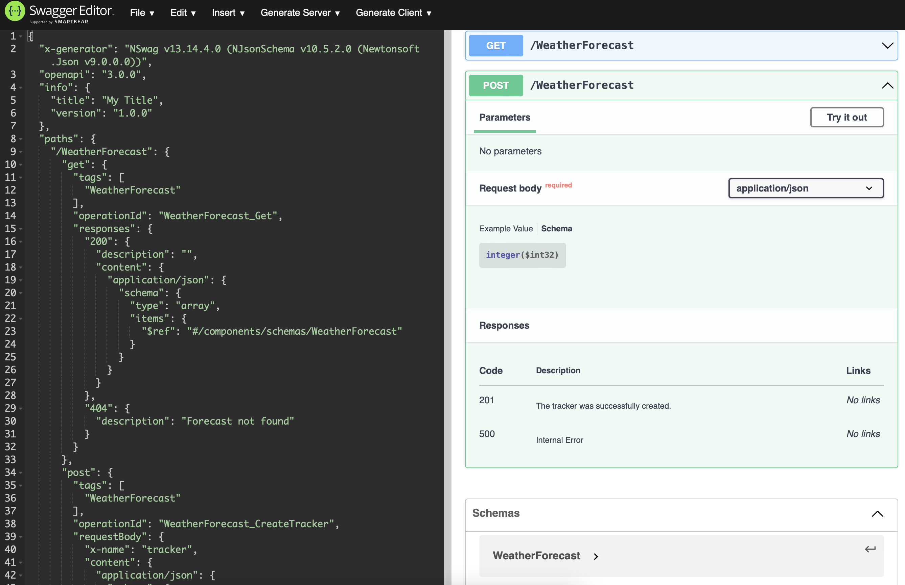
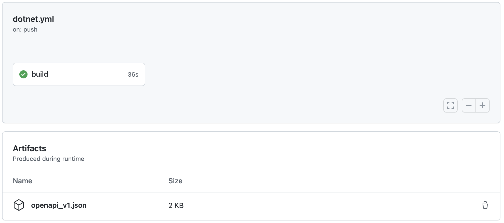

# Generate OpenApi spec

[](https://github.com/juzuluag/testmicsvc/actions/workflows/dotnet.yml)

The goal of this README is to illustrate how an openapi spec can be build based on the project's `assembly` file. The spec can be done **manually**, but it opens the windows for high code maintenance and also for error prune, since the manual file might not reflect what the service is capable of.
This is using `nswag` packages based on the configuration file `nswag_v1.json` to generate the api.

## Setup Project

```sh
dotnet --version
5.0.302
dotnet new webapi -n WebApp
dotnet new gitignore
cd WebApp
dotnet add package NSwag.MSBuild --version 13.14.4
dotnet add package NSwag.AspNetCore
dotnet add package Swashbuckle.AspNetCore.Annotations --version 6.2.3
```

### nswag run

In order to generate the spec at build time, make sure to enhance the project file `WebApp.csproj` by adding a `Target` entry.

```xml
...
<Target Name="NSwag" AfterTargets="Build">
    <Exec Command="$(NSwagExe_Net50) run nswag_v1.json /variables:Configuration=$(Configuration)" />
</Target>
...
```

## Build Project

(Note: Make sure `pwd` is `WebApp`)

```sh
dotnet build
```

It would create `openapi_v1.json` openapi spec with what the `controller` is about. This file can be published as an artifact of the CI pipeline in order to be consumed by a client. An easy way to look at the api is to use for instance [Swagger Editor](https://editor.swagger.io) and check the endpoints.
Below is an illustration of how the openapi spec is created and how a client can take advantage of the artifact generated.


## Controller Example

`WeatherForecastController` example has two methods (`GET` and `POST`) that contains annotations in order to have better coverage of what the api would do. This way the consumer of it will be aware of.

The following snipped code from the controller illustrates a `GET` method that creates an enumerable with specific `WeatherForecast` instances.

```c#
        [HttpGet]
        [SwaggerResponse((int)HttpStatusCode.OK, Type=typeof(IEnumerable<WeatherForecast>))]
        [SwaggerResponse((int)HttpStatusCode.NotFound, Description = "Forecast not found")]
        public IEnumerable<WeatherForecast> Get()
        {
            ...
        }
```

After running `dotnet build` on the project `openapi_v1.json` is created. Below is an extract of the `GET` method.

```json
...
"paths": {
    "/WeatherForecast": {
      "get": {
        "tags": [
          "WeatherForecast"
        ],
        "operationId": "WeatherForecast_Get",
        "responses": {
          "200": {
            "description": "",
            "content": {
              "application/json": {
                "schema": {
                  "type": "array",
                  "items": {
                    "$ref": "#/components/schemas/WeatherForecast"
                  }
                }
              }
            }
          },
          "404": {
            "description": "Forecast not found"
          }
        }
      },
  ...

```

This output can be checked also using a `Swagger Editor` like the picture below to have an idea how the api is going to look like.


## CI

As part of these steps, a simple `CI` [dotnet.yml](https://github.com/juzuluag/testmicsvc/blob/main/.github/workflows/dotnet.yml) file illustrates how to build the project and also how to push for the generated file as an artifact. The image below shows how the artifact would be located after CI runs.


## Summary

After all these points, avoiding to **manually** creating the api spec is the ideal case, eliminating to enter into an error prune scenario where the service and the consumer can be out-of-sync pretty easily.

## References

<https://kaylumah.nl/2021/05/23/generate-csharp-client-for-openapi.html>

<https://blog.rsuter.com/versioned-aspnetcore-apis-with-openapi-generation-and-azure-api-management/>

<https://github.com/RicoSuter/NSwag>

<https://editor.swagger.io>
